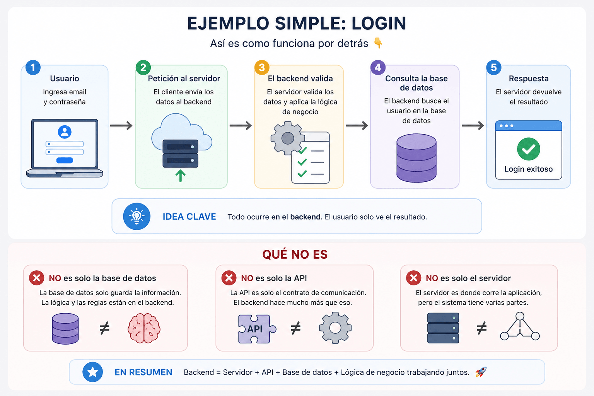

# Server API Database

## 🎯 Objetivo

Entender las partes principales de un sistema backend.

---

## 🧠 Explicación simple

Un sistema backend normalmente tiene tres partes principales:

* Server
* API
* Database

---

## 🧩 Server

El server es el programa que recibe peticiones y envía respuestas.

👉 Es donde vive tu aplicación backend.

---

## 🔗 API

La API es la forma en que otros sistemas se comunican con tu backend.

👉 Define qué se puede hacer (por ejemplo: login, crear usuario, etc.)

---

## 🗄️ Database

La base de datos es donde se guarda la información.

👉 Usuarios, productos, pedidos, etc.

---

## 🔁 Cómo trabajan juntos

1. El cliente envía una petición al server
2. El server usa la API para procesar la petición
3. El backend consulta la base de datos
4. El server devuelve una respuesta

---

## 🧩 Ejemplo

Login:

* Usuario envía email y contraseña
* Backend valida los datos
* Consulta la base de datos
* Responde si es correcto o no

---

## 🖼️ Flujo visual

---

## 💡 Idea clave

Un backend es la combinación de server, API y base de datos trabajando juntos.

---

## ⚠️ Errores comunes

* Pensar que API y server son lo mismo
* Pensar que la base de datos es toda la lógica
* No entender cómo fluye la información

---

## 🚀 Siguiente paso

👉 [Request lifecycle](./05-request-lifecycle.md)