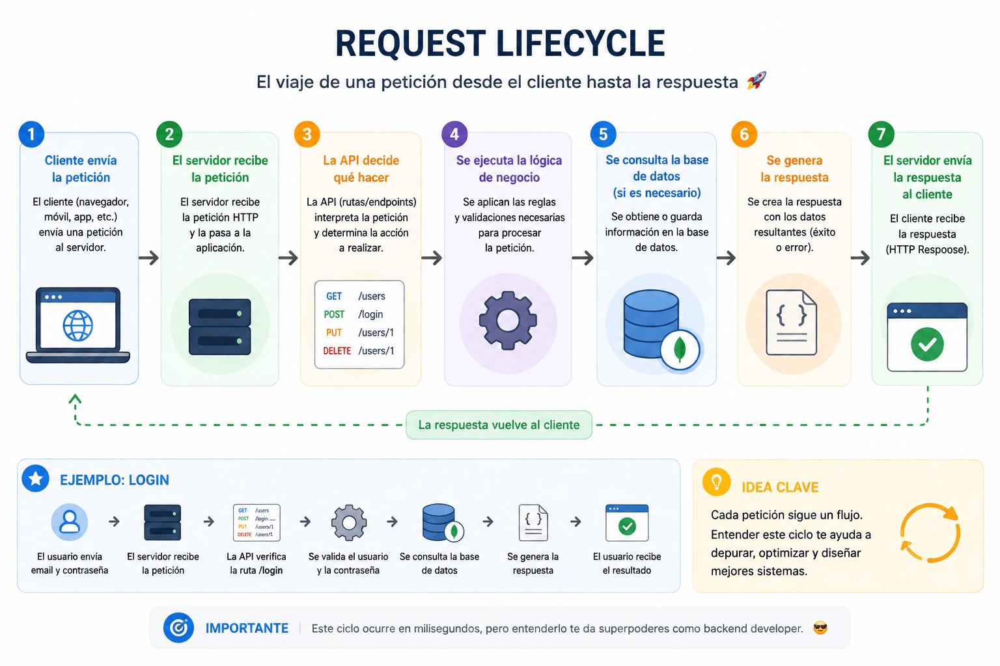

# Request lifecycle

## 🎯 Objetivo

Entender qué pasa desde que un cliente hace una petición hasta que recibe una respuesta.

---

## 🧠 Explicación simple

El request lifecycle es el recorrido que hace una petición dentro del sistema.

Empieza en el cliente y termina cuando recibe una respuesta.

---

## 🔁 Flujo general

1. El cliente envía una petición (request)
2. El server recibe la petición
3. La API decide qué hacer
4. Se ejecuta la lógica de negocio
5. Se consulta la base de datos (si es necesario)
6. Se genera una respuesta
7. El server envía la respuesta al cliente

---

## 🖼️ Flujo visual

---

## 🧩 Ejemplo simple

Login:

1. Usuario envía email y contraseña
2. El server recibe la petición
3. La API valida los datos
4. Se consulta la base de datos
5. Se genera una respuesta (éxito o error)
6. El cliente recibe el resultado

---

## 💡 Idea clave

Cada petición sigue un flujo.

👉 Entender este flujo es clave para entender el backend.

---

## ⚠️ Errores comunes

* Pensar que todo ocurre en un solo paso
* No entender dónde ocurre cada cosa
* Confundir API con lógica de negocio

---

## 🚀 Siguiente paso

👉 [Responsibilities](../02-code-principles/01-responsibilities.md)