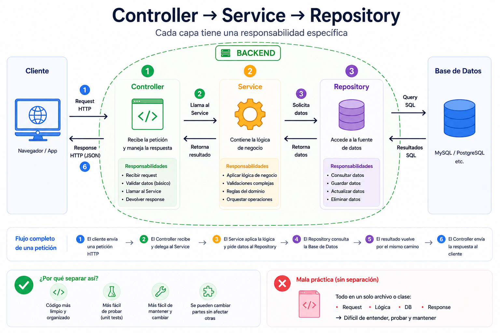

# Separation of concerns

## 🎯 Objetivo

Entender cómo separar correctamente las responsabilidades dentro de un sistema.

---

## 🧠 Explicación simple

Separation of concerns significa dividir el sistema en partes donde cada una se encarga de algo específico.

👉 Cada parte resuelve un problema distinto.

---

## 🧩 Ejemplo

En un backend típico:

* Controller → recibe la petición
* Service → contiene la lógica de negocio
* Repository → accede a la base de datos

👉 Cada capa tiene su propio “concern”.

---

## 🖼️ Flujo de capas

---

## ❌ Sin separación

Un solo archivo que:

* Recibe la petición
* Valida datos
* Aplica lógica
* Consulta la base de datos

👉 Todo mezclado = difícil de mantener

---

## ✅ Con separación

Cada parte hace una sola cosa:

* Código más claro
* Menos errores
* Más fácil de escalar

---

## 🔁 Relación con responsibilities

* Responsibility → qué hace cada parte
* Separation → cómo divides esas responsabilidades

👉 Van juntos.

---

## 💡 Idea clave

Divide el sistema en partes pequeñas con responsabilidades claras.

---

## ⚠️ Errores comunes

* Mezclar lógica de negocio con acceso a datos
* Poner demasiadas cosas en una sola capa
* Crear capas sin sentido solo por “seguir una arquitectura”

---

## 🚀 Siguiente paso

👉 [Coupling](./03-coupling.md)